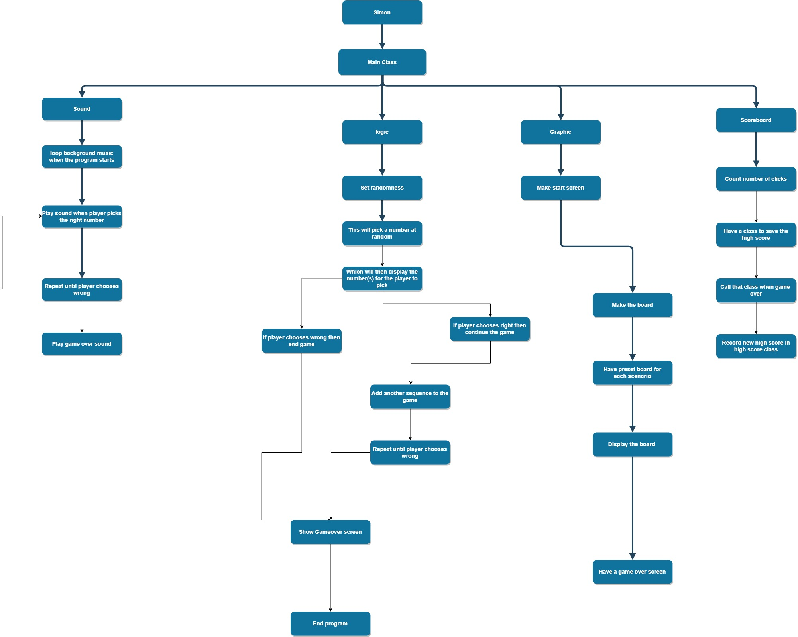

# SimonGame
<h2>Flowchart</h2>

<h3>Controls</h3>
<ul>
  <li>Press enter to start playing</li>
  <li>To play, use the keyboard to input the correct letter</li>
  <li>Try to remember each sequence</li>
</ul>
<h3>How to download the game</h3>

 Go to this <a href = "https://github.com/C-K-JavaFinal/SimonGame" repository to download the game

https://youtu.be/cGfPKWH0S3U
